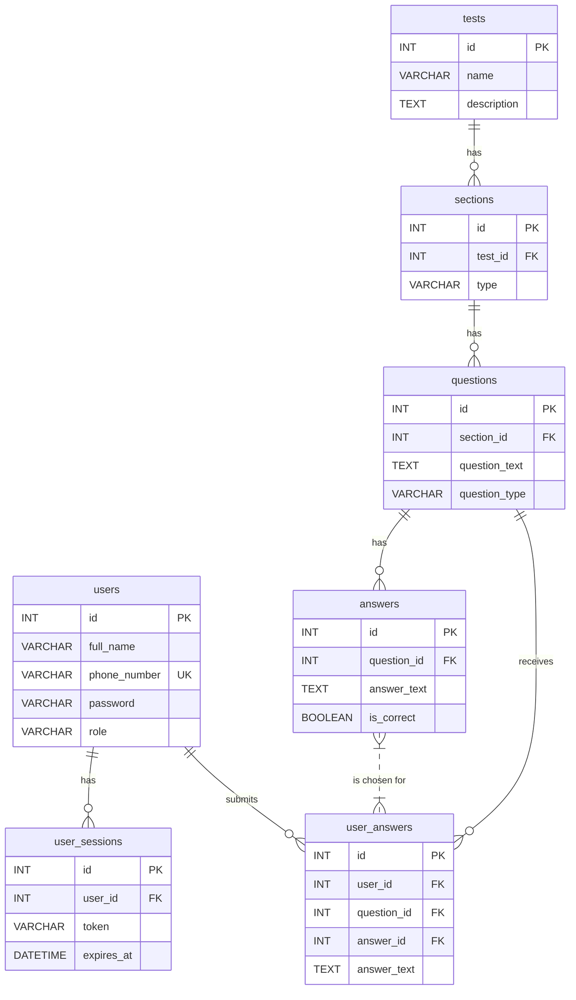

```mermaid
erDiagram
    users ||--o{ user_sessions : "has"
    users ||--o{ user_answers : "submits"
    tests ||--o{ sections : "has"
    sections ||--o{ questions : "has"
    questions ||--o{ answers : "has"
    questions ||--o{ user_answers : "receives"
    answers }|..|{ user_answers : "is chosen for"

    users {
        INT id PK
        VARCHAR full_name
        VARCHAR phone_number UK
        VARCHAR password
        VARCHAR role
    }

    user_sessions {
        INT id PK
        INT user_id FK
        VARCHAR token
        DATETIME expires_at
    }

    tests {
        INT id PK
        VARCHAR name
        TEXT description
    }

    sections {
        INT id PK
        INT test_id FK
        VARCHAR type
    }

    questions {
        INT id PK
        INT section_id FK
        TEXT question_text
        VARCHAR question_type
    }

    answers {
        INT id PK
        INT question_id FK
        TEXT answer_text
        BOOLEAN is_correct
    }

    user_answers {
        INT id PK
        INT user_id FK
        INT question_id FK
        INT answer_id FK
        TEXT answer_text
    }

```
